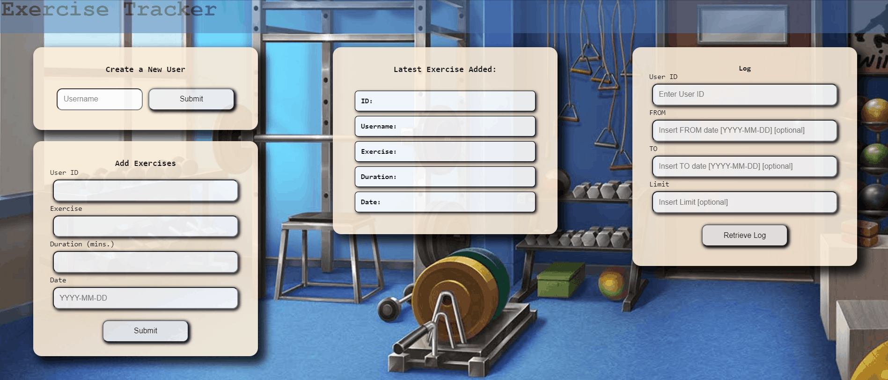

# Exercise Tracker

## Description

This is an exercise tracker that allows you to create a user, add entries to a training log and retrieve them.

User can also filter by date and limit the number of results.

Purpose of this project was for me to learn how to use MongoDB and Mongoose, and develop a MERN stack app.

This repo only contains the frontend.

## Technologies

- React
- Node.JS
- Express
- MongoDB
- Mongoose
- HTML
- CSS

## Installation

You will require access to the database this project is linked to, which can be provided by the project owner.
Alternatively, you can set up your own MongoDB database and connect to it.

- Clone the repository to your desired folder
- cd into the project folder
- open your IDE and run `npm i` to install all dependencies
- run `npm start` or `npm run dev` to spin up the project

## Project diary and takeaways

- 07/03/2022
  My goal for this project was to learn how to use MongoDb and Mongoose. I was quite surprised by how easy it all was, compared to using a standard PostgreSQL relational database. Interacting with MongoDB through Mongoose felt like writing standard JavaScript, just with new commands I hadn't used before. Reading about it, I also liked how easily scalable, flexible and performant it was. In addition to that, it's quite easy to set up a cluster via the MongoDB website and the GUI provided by MongoDB Atlas is a massive help. Documentation is also very detailed and simple to read and understand. 

  MongoDB is essentially schemaless, although you can define schemas to model you database after, in your code.

  An additional takeaway was how to use the backend to serve a static frontend using the base GET route.  
  The frontend is currently basic HTML, CSS and JavaScript, but my next step is to re-create it with React, so that this can be a full MERN stack app.

## License

[MIT](https://spdx.org/licenses/MIT.html)